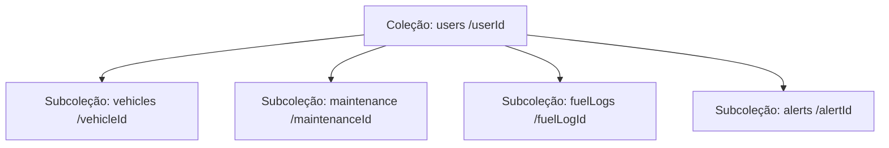

# 🚗 AutoLedge

AutoLedge é um aplicativo móvel premium projetado para proprietários de veículos gerenciarem de forma completa e intuitiva o histórico de manutenção, abastecimentos e despesas de seus automóveis. 

Inspirado no design minimalista e moderno da Tesla, o aplicativo oferece um tema escuro e fluido, transformando registros de manutenção em um passaporte digital valioso que melhora a confiabilidade do veículo, reduz custos de propriedade e aumenta a confiança na revenda.

---

## 📌 Índice

- [Funcionalidades Principais](#-funcionalidades-principais)
- [Identidade Visual e Design System](#-identidade-visual-e-design-system)
- [Tecnologias Utilizadas](#-tecnologias-utilizadas)
- [Arquitetura e Estrutura do Projeto](#-arquitetura-e-estrutura-do-projeto)
- [Modelagem do Banco de Dados (Firestore)](#-modelagem-do-banco-de-dados-firestore)
- [Configuração e Instalação](#-configuração-e-instalação)
  - [Variáveis de Ambiente](#variáveis-de-ambiente)
  - [Executando o Projeto](#executando-o-projeto)
- [Integrações e Casos Especiais](#-integrações-e-casos-especiais)
- [Visão de Futuro (Roadmap)](#-visão-de-futuro-roadmap)

---

## ⚡ Funcionalidades Principais

### 1. Garagem e Gerenciamento de Veículos
* **Cadastro Completo**: Registro de marca, modelo, motorização, placa, tipo de combustível (Gasolina, Álcool, Flex, Diesel, Elétrico) e odômetro atual.
* **Alternador Rápido de Veículos**: Um carrossel na parte superior do Painel permite alternar instantaneamente entre os veículos da garagem, exibindo apenas as despesas e alertas correspondentes.
* **Exclusão Segura**: Ao deletar um veículo, o aplicativo realiza uma exclusão em lote (*batch delete*) de todas as manutenções, abastecimentos e alertas associados, garantindo a integridade dos dados.

### 2. Painel Principal (Dashboard) de Estatísticas
* **Gráficos Dinâmicos**: Exibição da distribuição de custos (Combustível vs. Manutenção Preventiva vs. Manutenção Corretiva) e histórico mensal das despesas acumuladas nos últimos 6 meses.
* **Métricas em Tempo Real**: Cálculo automático das despesas totais, distância acumulada percorrida e o custo médio por quilômetro (R$/KM).
* **Alerta Crítico**: Área de destaque que avisa imediatamente se houver um serviço pendente próximo de vencer (menos de 7 dias ou menos de 500 km restantes).
* **Gráfico do Carro**: Ilustração minimalista do veículo para dar uma estética moderna ao app.

### 3. Registro de Manutenções (Preventiva & Corretiva)
* **Histórico Detalhado**: Linha do tempo contendo todas as ordens de serviço e manutenções passadas.
* **Cadastro Detalhado**: Informações de descrição do serviço, custo de peças, custo de mão de obra (com cálculo automático do custo total), quilometragem no momento do serviço, data e peças substituídas.
* **Anexo de Recibo**: Integração com a câmera e a galeria do celular (`expo-image-picker`) para anexar comprovantes fiscais ou fotos das peças trocadas.
* **Atualização Automática do Odômetro**: Ao cadastrar uma manutenção com quilometragem superior à atual do veículo, o odômetro do veículo é atualizado automaticamente.

### 4. Controle de Abastecimentos (Fuel Logs)
* **Log de Refuel**: Registro simplificado de litros, valor total pago e quilometragem.
* **Consumo e Métricas**: Exibição do preço calculado por litro e do odômetro do veículo para acompanhamento.
* **Atualização de Odômetro**: Assim como nas manutenções, o cadastro do abastecimento atualiza o odômetro geral do veículo se a quilometragem informada for maior.

### 5. Alertas e Lembretes Inteligentes
* **Dois Tipos de Alerta**: 
  1. **Por Data**: Útil para vencimento de IPVA, seguro, licenciamento ou revisões anuais.
  2. **Por Odômetro**: Útil para troca de óleo, rodízio de pneus, correia dentada, pastilhas de freio, etc.
* **Controle de Status**: Marque alertas como concluídos direto na lista, limpando o dashboard de pendências.

---

## 🎨 Identidade Visual e Design System

O AutoLedge adota uma estética **Tesla Minimalist**:
* **Fundo Preto Profundo (`#000000`)** e **Superfícies Escuras (`#0F0F12`, `#111115`)**: Reduz a fadiga visual e poupa bateria em telas OLED.
* **Texto Branco Puro (`#FFFFFF`) e Cinza Suave (`#8E8E93`, `#55555C`)**: Contraste perfeito e hierarquia visual refinada.
* **Acentos Vermelho Tesla (`#E82127`)**: Usado cirurgicamente para botões de ação primária, notificações críticas e realces.
* **Componentes Customizados**:
  * [TeslaCard](file:///c:/Users/jorge/OneDrive/Documentos/Projetos/auto-ledge/src/components/TeslaCard.tsx): Cartões elegantes com bordas finas e fundos escuros.
  * [TeslaButton](file:///c:/Users/jorge/OneDrive/Documentos/Projetos/auto-ledge/src/components/TeslaButton.tsx): Botões estilizados com suporte a estados de carregamento (*loading*), variantes contornadas (*outline*) e desabilitadas.
  * [TeslaInput](file:///c:/Users/jorge/OneDrive/Documentos/Projetos/auto-ledge/src/components/TeslaInput.tsx): Campos de entrada de texto premium com suporte a formatação de data e área de texto multilinha.

---

## 🛠 Tecnologias Utilizadas

* **Framework Principal**: [React Native](https://reactnative.dev/) com [Expo](https://expo.dev/) (SDK 54).
* **Linguagem**: [TypeScript](https://www.typescriptlang.org/) para tipagem estática e segurança de código.
* **Backend & Autenticação**: [Firebase v12](https://firebase.google.com/):
  * **Firebase Auth**: Login por e-mail/senha e autenticação social com o Google.
  * **Cloud Firestore**: Banco de dados NoSQL em tempo real para sincronização instantânea de veículos, manutenções, abastecimentos e alertas.
* **Navegação**: Sistema customizado de abas minimalistas integrando componentes nativos sem sobrecarga de bibliotecas externas complexas.
* **Armazenamento de Imagens**: `expo-image-picker` para captura de imagens com solicitações de permissão nativa para Android/iOS.
* **Ícones**: `lucide-react-native` para iconografia minimalista e elegante.
* **Notificações Internas**: `react-native-toast-message` para alertas visuais flutuantes (*toasts*) de sucesso e erro.
* **Layouts**: `react-native-safe-area-context` para suporte perfeito a notches e barras de navegação dos sistemas operacionais.

---

## 📁 Arquitetura e Estrutura do Projeto

Abaixo está a organização dos diretórios do projeto a partir da pasta `/src`:

```bash
src/
├── components/          # Componentes de UI reaproveitáveis (TeslaCard, TeslaButton, TeslaInput, CustomModal, etc.)
├── context/             # AppContext.tsx - Gerenciamento global de estado (Autenticação, Dados e Ações de Banco de Dados)
├── screens/             # Telas principais do fluxo da aplicação
│   ├── SplashScreen/    # Tela de abertura inicial com animação
│   ├── LoginScreen/     # Fluxo de login e cadastro (E-mail/Senha e Google Auth)
│   ├── DashboardScreen/ # Painel de métricas, carrossel de garagem, gráficos e alertas críticos
│   ├── MaintenanceScreen/# Registro de ordens de serviço e linha do tempo de manutenções
│   ├── FuelScreen/      # Lista e controle de logs de combustível
│   ├── AlertScreen/     # Agendador de alertas de data ou quilometragem
│   └── VehiclesScreen/  # Garagem de veículos com gerenciamento de cadastro
├── services/            # Integração com APIs externas e Firebase (db.ts e firebase.ts)
├── theme/               # Paleta de cores oficial (colors.ts)
├── types/               # index.ts - Interfaces de dados e tipos TypeScript
└── utils/               # Utilitários de data, formatação de textos e disparo de toasts
```

---

## 🗄 Modelagem do Banco de Dados (Firestore)

Os dados estão estruturados no Firestore sob a coleção principal `users` e subcoleções específicas por usuário para otimização de performance e privacidade:



### Detalhamento das Entidades

| Coleção / Subcoleção | Campos Principais | Descrição |
| :--- | :--- | :--- |
| **`users`** | `uid`, `email`, `displayName`, `photoURL`, `activeVehicleId`, `createdAt`, `updatedAt` | Cadastro do perfil do usuário e ID do carro selecionado no momento. |
| **`vehicles`** | `id`, `userId`, `plate`, `brand`, `model`, `engine`, `fuelType`, `currentOdometer`, `createdAt` | Informações técnicas de cada carro na garagem do usuário. |
| **`maintenance`** | `id`, `vehicleId`, `type` (*preventive* ou *corrective*), `description`, `partsCost`, `laborCost`, `totalCost`, `date`, `partsDetail`, `attachmentUri`, `odometer` | Registro de serviços e custos, com possibilidade de anexar link da imagem do recibo. |
| **`fuelLogs`** | `id`, `vehicleId`, `date`, `liters`, `totalCost`, `odometer`, `createdAt` | Logs de abastecimentos para acompanhamento de quilometragem e gastos. |
| **`alerts`** | `id`, `vehicleId`, `type` (*date* ou *odometer*), `title`, `targetDate`, `targetOdometer`, `status` (*pending* ou *completed*) | Notificações de manutenção preventiva programadas no futuro. |

---

## ⚙ Configuração e Instalação

### Pré-requisitos
1. [Node.js](https://nodejs.org/) instalado (versão LTS recomendada).
2. Celular com o aplicativo [Expo Go](https://expo.dev/client) ou emulador Android/iOS configurado.

### Passos para Instalação

1. Clone o repositório em sua máquina local:
   ```bash
   git clone https://github.com/jorgerios7/auto-ledge.git
   cd auto-ledge
   ```

2. Instale as dependências do projeto:
   ```bash
   npm install
   ```

3. Duplique o arquivo `.env.example` criando um arquivo `.env` na raiz do projeto:
   ```bash
   cp .env.example .env
   ```

### Variáveis de Ambiente

Preencha o arquivo `.env` com as chaves do seu projeto Firebase e Google Cloud:

```ini
EXPO_PUBLIC_FIREBASE_API_KEY=sua_api_key
EXPO_PUBLIC_FIREBASE_AUTH_DOMAIN=seu_projeto.firebaseapp.com
EXPO_PUBLIC_FIREBASE_PROJECT_ID=seu_projeto_id
EXPO_PUBLIC_FIREBASE_STORAGE_BUCKET=seu_projeto.appspot.com
EXPO_PUBLIC_FIREBASE_MESSAGING_SENDER_ID=seu_sender_id
EXPO_PUBLIC_FIREBASE_APP_ID=seu_app_id
EXPO_PUBLIC_GOOGLE_WEB_CLIENT_ID=seu_google_client_id_para_web
```

> [!NOTE]
> Lembre-se também de adicionar o arquivo `google-services.json` configurado na pasta raiz para builds nativas do Android. Você pode se basear no [google-services.json.example](file:///c:/Users/jorge/OneDrive/Documentos/Projetos/auto-ledge/google-services.json.example).

### Executando o Projeto

Você pode iniciar o servidor de desenvolvimento do Expo:

```bash
# Iniciar o servidor Expo (você pode escanear o QR Code no app Expo Go)
npm run start

# Executar diretamente em um emulador Android
npm run android

# Executar diretamente em um simulador iOS
npm run ios

# Abrir no navegador (web)
npm run web
```

---

## 🔗 Integrações e Casos Especiais

### Autenticação Google
O recurso de Login Social com o Google utiliza a biblioteca nativa `@react-native-google-signin/google-signin`. 
* **Expo Go (Fallback)**: Devido às limitações de módulos nativos no Expo Go padrão, se o aplicativo detectar que não está rodando em uma compilação nativa desenvolvida (`npx expo run:android` ou `npx expo run:ios`), o botão de Google Sign-in exibirá um aviso informativo amigável orientando o usuário a usar E-mail/Senha ou gerar a build nativa.

### Sincronização e Atualizações
O estado geral do app é gerenciado pelo [AppContext.tsx](file:///c:/Users/jorge/OneDrive/Documentos/Projetos/auto-ledge/src/context/AppContext.tsx). A alteração de veículos na garagem desencadeia uma filtragem imediata local nas coleções de dados, economizando requisições desnecessárias à nuvem.

---

## 🔮 Visão de Futuro (Roadmap)

Embora o aplicativo já forneça uma solução de gerenciamento robusta, as seguintes funcionalidades estão previstas para o desenvolvimento futuro:

1. **Digital Maintenance Passport**: Exportação de um relatório consolidado com o selo de autenticidade dos serviços realizados no carro, aumentando a confiança e o valor de mercado na hora da revenda.
2. **OCR Invoice Scanning**: Scanner de notas fiscais automático por IA, que preenche automaticamente a descrição do serviço, os valores de peças e mão de obra a partir da foto do recibo.
3. **Assistente de Manutenção por IA**: Integração com APIs como Gemini/GPT para fornecer diagnósticos preventivos e sugestões de revisão com base nos sintomas relatados pelo usuário ou quilometragem percorrida.
4. **Monitoramento Avançado de Saúde**: Alertas preditivos sobre a vida útil de peças críticas (ex. alternador, bateria, suspensão) com base no modelo do carro e histórico.
